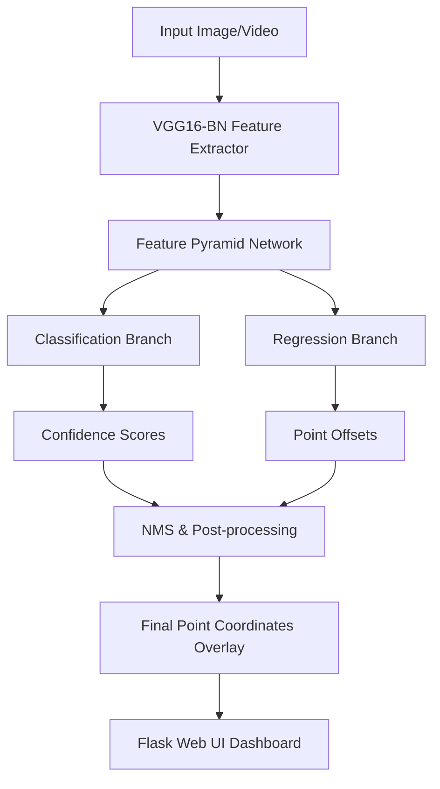

<div align="center">
  <h1> CrowdVision-P2PNet</h1>
  <p><strong>A Deep Learning-based Crowd Counting & Analysis Platform</strong></p>

  [](https://www.python.org/)
  [](https://pytorch.org/)
  [](https://flask.palletsprojects.com/)
  [](#)
</div>

<br>

## Project Overview

**CrowdVision-P2PNet** is an advanced computer vision system designed to automatically detect and count individuals in highly dense crowd scenarios. Moving beyond traditional density map estimation, this project leverages the state-of-the-art **Point-to-Point Network (P2PNet)** to predict the exact location of individuals, offering unparalleled accuracy.

** Key Achievement:** The base P2PNet model has been extensively **fine-tuned on a custom proprietary dataset (`railway_dataset_2`)**, significantly improving its robustness, precision, and real-world applicability in transit and high-traffic public environments.

This repository provides a complete end-to-end solution: a fine-tuned deep learning backend, a CLI for batch processing, and a modern **Flask-based web dashboard** for real-time visualization and statistical analysis of images and videos.

## Key Features

- **Domain-Specific Fine-Tuning**: Optimized specifically for railway and transit environments using `railway_dataset_2`.
- **Precise Point Detection**: Predicts exact (x,y) coordinates for every person, rather than estimating blobs.
- **Image & Video Support**: Process static images or entire video feeds with frame-by-frame analysis.
- **Interactive Web Dashboard**: User-friendly UI to upload media, configure thresholds, and view results instantly.
- **Comprehensive Analytics**: Aggregates average, minimum, and maximum counts across video segments.

##  Technology Stack

- **Deep Learning**: PyTorch, Torchvision
- **Computer Vision**: OpenCV, PIL (Pillow)
- **Web Framework**: Flask, HTML5, CSS3
- **Model Architecture**: VGG16-BN Backbone, Feature Pyramid Network (FPN), P2PNet

##  Architecture & Workflow



##  Getting Started

### 1. Prerequisites

- Python 3.8 or higher
- Git
- CUDA-capable GPU (Recommended for video inference)

### 2. Installation

Clone the repository and set up your virtual environment:

```bash
# Clone the repo
git clone https://github.com/yourusername/CrowdVision-P2PNet.git
cd CrowdVision-P2PNet

# Create and activate virtual environment (Windows)
python -m venv .venv
.venv\Scripts\activate

# Linux/Mac
# python3 -m venv .venv
# source .venv/bin/activate
```

Install the required dependencies:

```bash
# Install core dependencies
pip install -r requirements.txt
pip install -r requirements_web.txt
pip install -r CrowdCounting-P2PNet/requirements.txt
```

### 3. Setup Model Weights & Assets

Ensure your pre-trained and fine-tuned weights are placed correctly:
- Place your fine-tuned `best_mae.pth` inside `CrowdCounting-P2PNet/output_weights/`
- Place the VGG16-BN backbone weights (`vgg16_bn-*.pth`) in `CrowdCounting-P2PNet/`

> *Note: Due to GitHub's file size limits, model weights (`*.pth`), custom datasets (`railway_dataset_2`), and demo videos are ignored via `.gitignore` and should be hosted externally (e.g., Google Drive/AWS).*

##  Usage Instructions

### Web Interface (Recommended)

Start the Flask application server:

```bash
python app.py
```
Open your browser and navigate to `http://localhost:5000`. You can upload images or videos, adjust detection thresholds, and view the tracking visualizations.

### Command-Line Interface

For batch processing or server-side automation:

**Process an Image:**
```bash
python run_demo.py --input assets/sample.jpg --output_dir demo_results/ --threshold 0.15
```

**Process a Video:**
```bash
python run_demo.py --input assets/sample_video.mp4 --output_dir demo_results/ --threshold 0.15
```

##  Future Improvements

- [ ] **Real-time Camera Stream Integration**: Connect the Flask backend directly to RTSP streams for live CCTV monitoring.
- [ ] **Temporal Tracking**: Implement DeepSORT or ByteTrack to track unique individuals across frames rather than just frame-by-frame counting.
- [ ] **Edge Deployment**: Convert the PyTorch model to TensorRT or ONNX for optimized inference on edge devices like Jetson Nano.
- [ ] **Containerization**: Create a `Dockerfile` for seamless cross-platform deployment.

##  Acknowledgments

- The foundational **P2PNet** architecture authors: [Real-Time Crowd Counting via Joint Detection and Tracking](https://github.com/TuSimple/crowd-counting-p2pnet)
- VGG16 Backbone weights provided by PyTorch model zoo.

---
*This project was developed to demonstrate advanced deep learning capabilities in computer vision and deployment architectures.*
