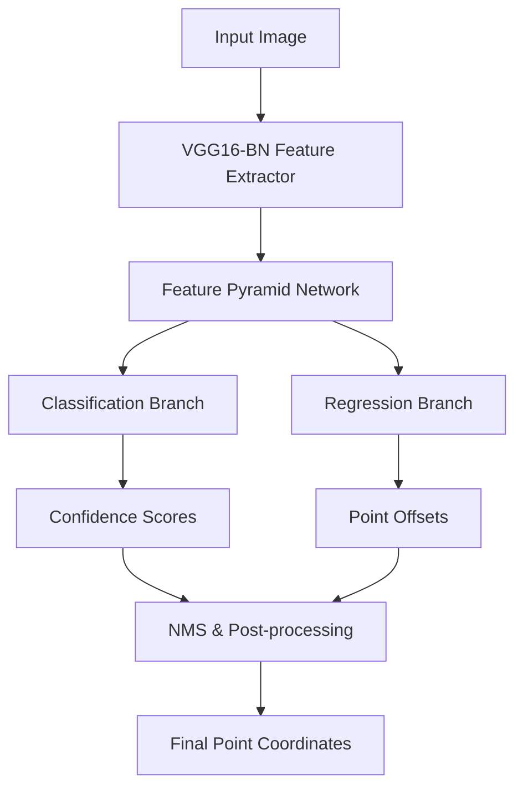

<div align="center">
  <h1>🎯 CrowdVision P2PNet</h1>
  <p><strong>A Deep Learning-based Crowd Counting & Analysis Platform</strong></p>

  [](https://www.python.org/)
  [](https://pytorch.org/)
  [](https://flask.palletsprojects.com/)
  [](LICENSE)
</div>

<br>

## 📋 Overview

**CrowdVision P2PNet** is an advanced crowd counting system that utilizes a state-of-the-art **Point-to-Point Network (P2PNet)** architecture (ICCV 2021 Oral). The project goes beyond traditional density map estimation by predicting the exact location of individuals within a crowd, offering unparalleled accuracy in highly dense scenarios. 

This repository includes a fully functional deep learning backend, a CLI for batch processing, and a modern **Flask-based web interface** for real-time visualization and statistical analysis of both images and videos.

## ✨ Key Features

- **Precise Point Detection**: Unlike density-map methods, predicts exact (x,y) coordinates for every person.
- **Image & Video Support**: Process static images or entire video feeds with frame-by-frame analysis.
- **Interactive Web Dashboard**: User-friendly UI to upload media, configure thresholds, and view results.
- **Comprehensive Analytics**: Aggregates average, minimum, and maximum counts across video segments.
- **Hardware Agnostic**: Supports both CUDA-accelerated GPU inference and CPU fallback.

## 🛠️ Technology Stack

- **Deep Learning**: PyTorch, Torchvision
- **Computer Vision**: OpenCV, PIL (Pillow)
- **Web Framework**: Flask, HTML5, CSS3
- **Model Architecture**: VGG16-BN Backbone, FPN Decoder, P2PNet (Point-to-Point Network)

## 🏗️ Architecture



## 🚀 Getting Started

### 1. Prerequisites

- Python 3.8 or higher
- Git
- (Optional but recommended) CUDA-capable GPU

### 2. Installation

Clone the repository and set up your virtual environment:

```bash
# Clone the repo
git clone https://github.com/yourusername/CrowdVision-P2PNet.git
cd CrowdVision-P2PNet

# Create and activate virtual environment (Windows)
python -m venv .venv
.venv\Scripts\activate

# Linux/Mac
# python3 -m venv .venv
# source .venv/bin/activate
```

Install the required dependencies:

```bash
# Install core PyTorch dependencies
pip install -r requirements.txt

# Install web application dependencies
pip install -r requirements_web.txt

# Install P2PNet specific dependencies
pip install -r CrowdCounting-P2PNet/requirements.txt
```

### 3. Model Weights Download

Ensure you have the pre-trained weights placed in the correct directories:
- Place `best_mae.pth` inside `CrowdCounting-P2PNet/output_weights/`
- Place the VGG16-BN backbone weights (`vgg16_bn-*.pth`) in `CrowdCounting-P2PNet/`

> Note: Due to size limitations, model weights are not tracked via Git.

## 💻 Usage

### Web Interface (Recommended)

Start the Flask server:

```bash
python app.py
```
Open your browser and navigate to `http://localhost:5000`. You can upload images or videos directly through the UI.

### Command-Line Interface

For batch processing or server-side automation, use the CLI:

**Process an Image:**
```bash
python run_demo.py --input data/crowd.jpg --output_dir results/ --threshold 0.15
```

**Process a Video:**
```bash
python run_demo.py --input data/video.mp4 --output_dir results/ --threshold 0.15
```

## 📊 Performance Benchmark

P2PNet achieves state-of-the-art results across standard datasets:

| Dataset | MAE | MSE |
|---------|-----|-----|
| SHTech-A | 52.74 | 85.06 |
| SHTech-B | 6.25 | 9.90 |
| UCF_CC_50 | 172.72 | 256.18 |
| NWPU-Crowd | 77.44 | 362.00 |

*(Lower is better)*

## 🤝 Acknowledgments

- The original **P2PNet** authors: [Real-Time Crowd Counting via Joint Detection and Tracking](https://github.com/TuSimple/crowd-counting-p2pnet)
- VGG16 Backbone weights provided by PyTorch model zoo.

---
*This project was developed for academic and portfolio demonstration purposes.*
